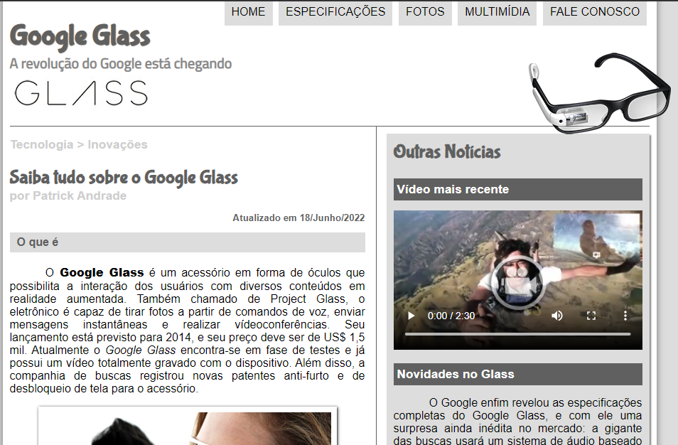
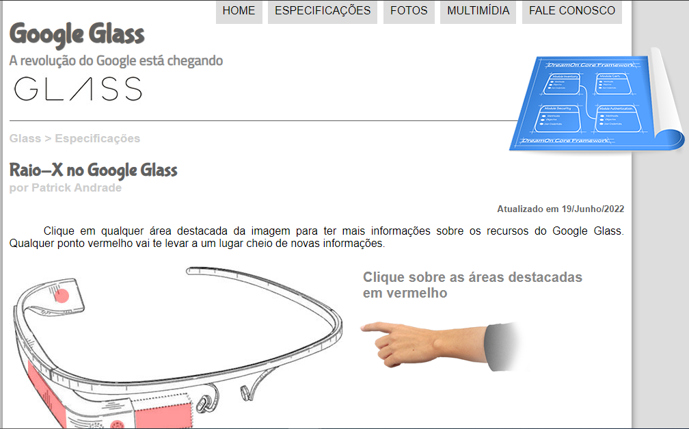
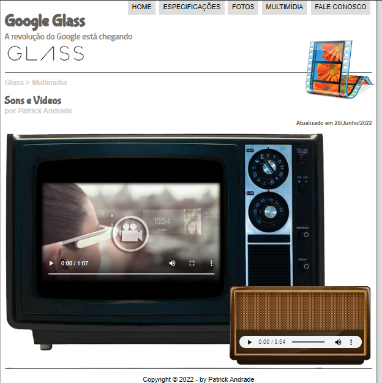
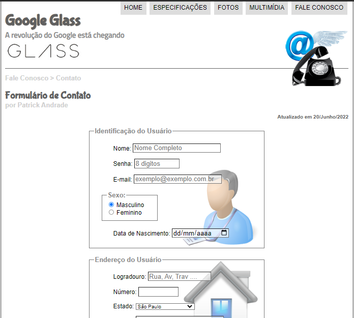

# projeto-site-glass

Esse foi um projeto do curso em vídeo com Gustavo Guanabara, basicamente é a montagem de um site sobre o Google Glass que contém a parte de informações sobre o óculos, tem algumas mídias e a área de contato.
---

 ## HOME
 Aqui é uma apresentação do óculos, tem uma tabela com algums informações, também contém dois vídeos e uma foto que quando passa o mouse por cima aparece a imagem fica sombreada e aparece uma informação.
 O menu suspenso passando o mouse a imagem vai alterando de acordo com a página que será acessada caso clique.
 No rodapé de todas as páginas tem a autoria e rede sociais que estão com ancora para os links.

## ESPECIFICAÇÕES
Aqui tem sobre as funcionalidades do óculos e tem parte sensíveis ao clique do mouse, são as partes destacadas com rosa, ao clicar aparece informações sobre aquela parte do óculos.

## FOTOS
Tem algumas fotos que quando passa o mouse elas dão zoom e aparece o título.

## MULTIMÍDIA
Contém um vídeo e um áudio falando sobre o óculos.

## FALE CONOSCO
Tem tabelas com campos para entrar em contato e até mesmo fazer o pedido do óculos, pode escolher a cor, a quantidade já é feita a multiplicação e mostra o valor final.
Cada campo tem uma particularidade, limite de caracteres, a senha não fica visível, quase todos campos foi colocado um texto sombreado para orientar como preencher com as informações.

