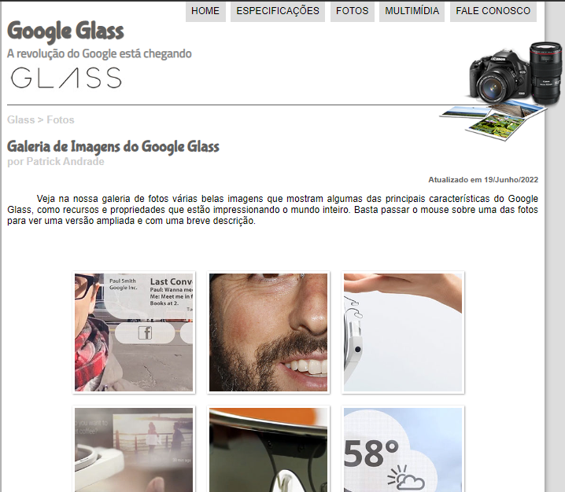

# projeto-site-glass
Esse foi um projeto do curso em vídeo com Gustavo Guanabara, basicamente é a montagem de um site sobre o Google Glass que contém a parte de informações sobre o óculos, tem algumas mídias e a área de contato.
---

 ## HOME

## ESPECIFICAÇÕES

## FOTOS

## MULTIMÍDIA

## FALE CONOSCO

